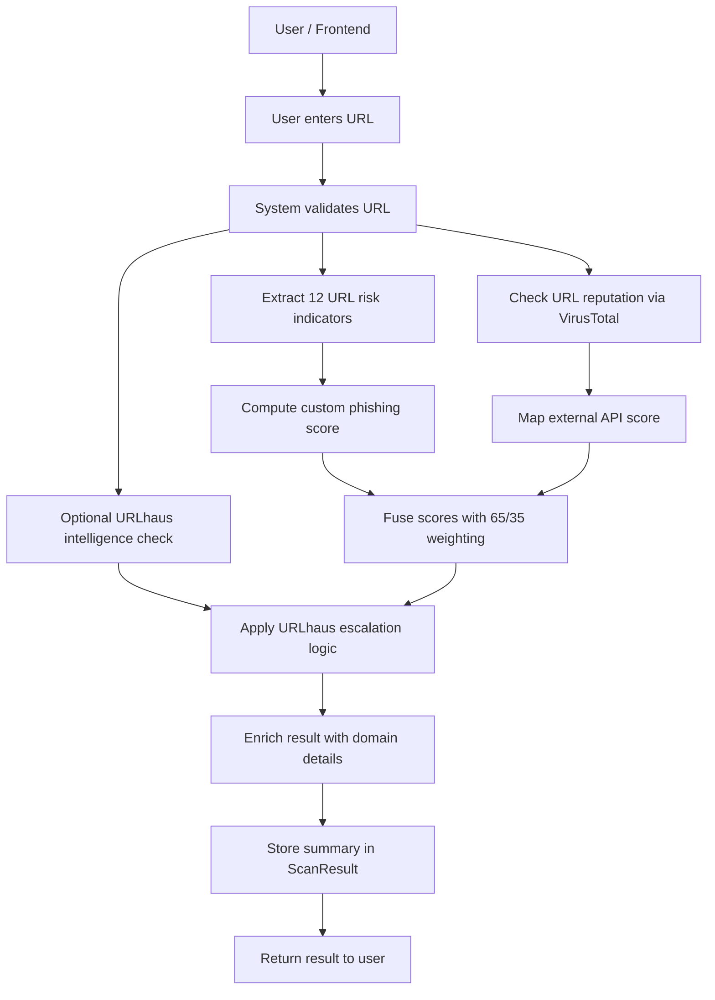
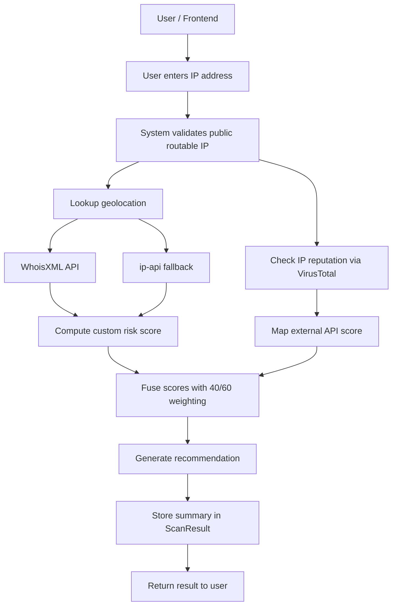
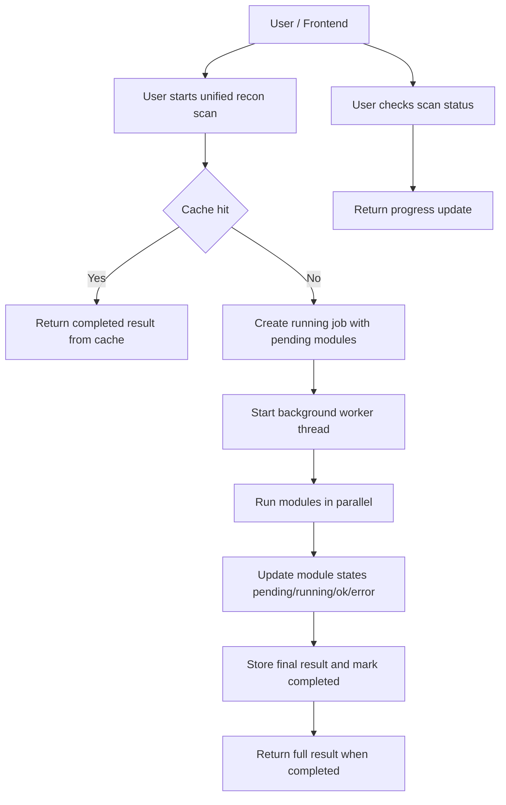

# CyberShield Flow Diagrams

This file contains all flow diagrams extracted from the main documentation in a single place.

## 1. URL Phishing Detection Flow

### 1.1 Mermaid



### 1.2 Boxed ASCII

```text
+-----------------------+
| User / Frontend       |
+-----------+-----------+
            |
            v
+-----------------------+
| User enters URL       |
+-----------+-----------+
            |
            v
+-----------------------+
| System validates URL  |
+-----+-----------+-----+
      |           |
      v           v
+-----------+   +-------------------+
| VirusTotal|   | URLhaus optional  |
| URL scan  |   | intelligence check|
+-----+-----+   +---------+---------+
      |                   |
      v                   v
+-----------------------+ +----------------------+
| ThreatIntelligence    | | URLhaus escalation   |
| Mapper api score      | | logic                |
+-----------+-----------+ +----------+-----------+
            ^                       ^
            |                       |
+-----------+-----------+           |
| URLFeatureExtractor   |           |
| 12 indicators         |           |
+-----------+-----------+           |
            |                       |
            v                       |
+-----------------------+           |
| PhishingScorer        |-----------+
| custom score          |
+-----------+-----------+
            |
            v
+-----------------------+
| HybridDecisionEngine  |
| final score 65/35     |
+-----------+-----------+
            |
            v
+-----------------------+
| Domain enrichment     |
+-----------+-----------+
            |
            v
+-----------------------+
| Persist ScanResult    |
+-----------+-----------+
            |
            v
+-----------------------+
| JSON response         |
+-----------------------+
```

## 2. IP Reputation Analysis Flow

### 2.1 Mermaid



### 2.2 Boxed ASCII

```text
+-----------------------+
| User / Frontend       |
+-----------+-----------+
            |
            v
+-----------------------+
| User enters IP        |
+-----------+-----------+
            |
            v
+-----------------------+
| System validates      |
| public IP             |
+-----+-----------+-----+
      |           |
      v           v
+-----------+   +-----------------------+
| VirusTotal|   | Geolocation lookup    |
| IP scan   |   +-----------+-----------+
+-----+-----+               |
      |                     v
      |          +----------+-----------+
      |          | WhoisXML API         |
      |          +----------+-----------+
      |                     |
      |          +----------+-----------+
      |          | ip-api fallback      |
      |          +----------+-----------+
      |                     |
      |                     v
      |          +----------+-----------+
      |          | CustomRiskAnalyzer   |
      |          | custom score         |
      |          +----------+-----------+
      v                     |
+-----------------------+   |
| ThreatIntelligence    |   |
| Mapper api score      |   |
+-----------+-----------+   |
            |               |
            v               v
+-----------------------+---+--+
| HybridScoringEngine 40/60      |
| final score + severity         |
+-----------+--------------------+
            |
            v
+-----------------------+
| Recommendation        |
| generation            |
+-----------+-----------+
            |
            v
+-----------------------+
| Persist ScanResult    |
+-----------+-----------+
            |
            v
+-----------------------+
| JSON response         |
+-----------------------+
```

## 3. Unified Recon Async Lifecycle

### 3.1 Mermaid



### 3.2 Boxed ASCII

```text
+-------------------------------+
| User / Frontend               |
+---------------+---------------+
                |
                v
+-------------------------------+
| User starts unified recon scan|
+---------------+---------------+
                |
                v
+-------------------------------+
| Cache hit?                    |
+----------+--------------------+
           |Yes                      No|
           v                           v
+---------------------------+   +------------------------------+
| Return completed job      |   | Create running job           |
| with cached result        |   | modules = pending            |
+---------------------------+   +---------------+--------------+
                                              |
                                              v
                                  +-----------+---------------+
                                  | Start background worker    |
                                  +-----------+---------------+
                                              |
                                              v
                                  +-----------+---------------+
                                  | Execute modules in parallel|
                                  +-----------+---------------+
                                              |
                                              v
                                  +-----------+---------------+
                                  | Update states              |
                                  | pending/running/ok/error   |
                                  +-----------+---------------+
                                              |
                                              v
                                  +-----------+---------------+
                                  | Mark completed + store     |
                                  | final result               |
                                  +-----------+---------------+
                                              |
                +-----------------------------+-----------------------------+
                |                                                           |
                v                                                           v
+-------------------------------+                          +-------------------------------+
| User checks scan status       |                          | Completed status includes      |
| and gets live progress        |                          | full result payload            |
+-------------------------------+                          +-------------------------------+
```
